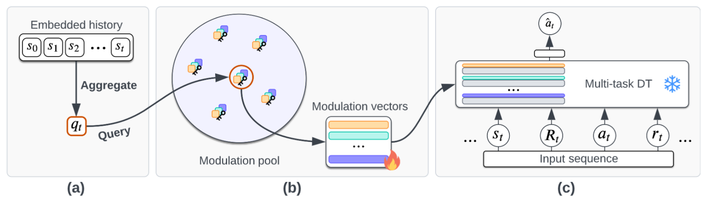

# Learning to Modulate pre-trained Models in RL 
Thomas Schmied **1**, Markus Hofmarcher **1**, Fabian Paischer**1**, Razvan Pacscanu**2**, Sepp Hochreiter**1,3** 

**1**ELLIS Unit Linz and LIT AI Lab, Institute for Machine Learning, Johannes Kepler University Linz, Austria\
**2**DeepMind\
**4**Institute of Advanced Research in Artificial Intelligence (IARAI), Vienna, Austria

This repository will contain the source code and link to the generated datasets for our paper **"Learning to Modulate pre-trained Models in RL"** accepted at the [Reincarnating RL Workshop](https://reincarnating-rl.github.io/) at ICLR 2023. The paper is available [here](https://openreview.net/forum?id=Us6BtPZGei3). 

:warning: ** UNDER CONSTRUCTION** :warning:

## Approach

## Accessing the Data

## Installation
TBD

## Running experiments
TBD

## Citation
TBD

